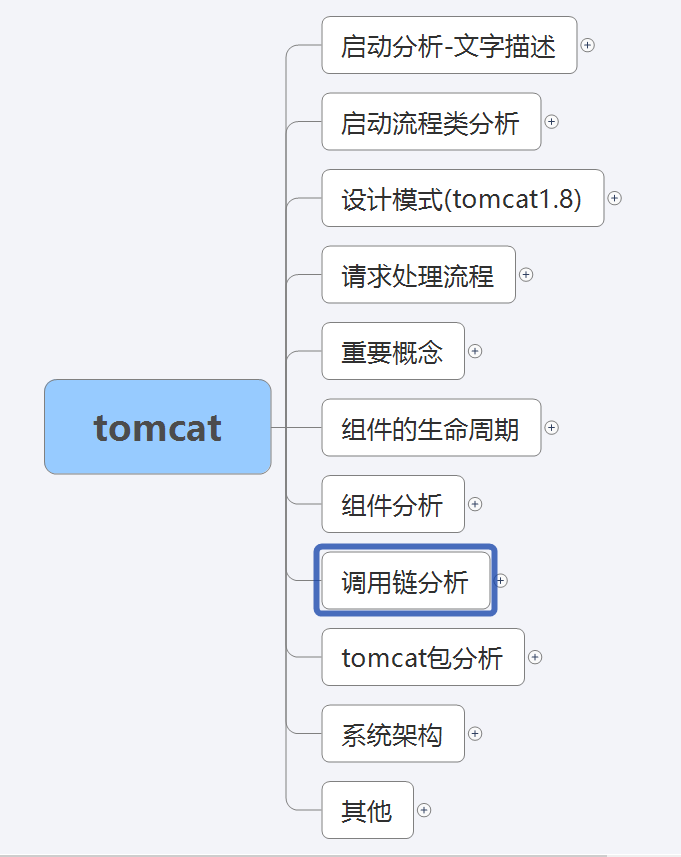
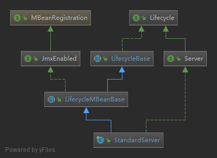
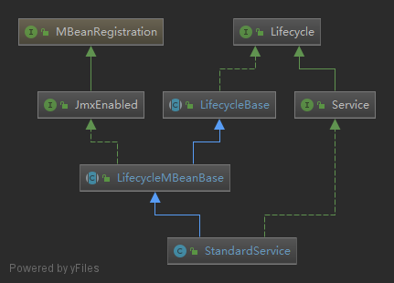
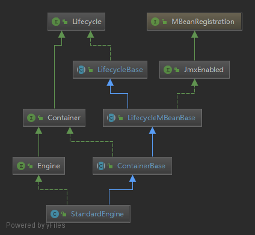
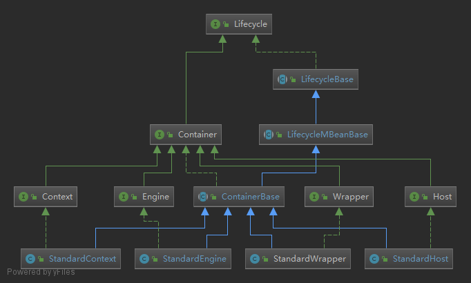
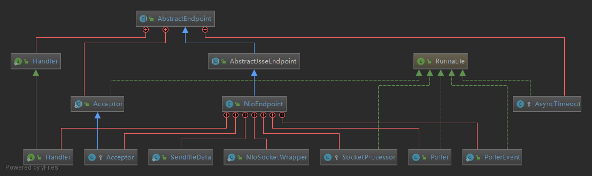

# tomcat8分析

#### 项目介绍
tomcat源码分析

#### 软件架构
软件架构说明

#### 安装教程

1. 导入到eclipse
2. 检查Problems问题，如果是test的bug问题，不需要理会，不影响分析tomcat
3. 启动方式：/tomcat/java/org/apache/catalina/startup/Bootstrap.java，右键启动run as->java application
4. 内部流程代码加了很多中文注释，非常直观
5. 提供tomcat的时序分析图
6. 提供tomcat的总结xmind图

    

        
    

7. 提供tomcat的脚本分析
8. 提供tomcat的特殊部署模式分析
9. 提供源码中文解释

#### StandardServer

#### StandardService

    

#### StandardService

    

#### container

    

#### NioEndpoint

    

#### 使用说明

1. 环境配置：JDK1.8,MAVEN
2. 需要了解通信模式:AIO,BIO,NIO
3. 需要了解线程相关知识
4. 需要了解设计模式
5. 需要了解容器和servlet的基础概念

#### 参与贡献

1. fzj读你
2. qq群:132959169
3. 二维码扫加群：
       

           
       

#### 个人专场

1. 全能型网关：
    https://gitee.com/fzjlovely/tgit-gateway.git
2. java培训案例：
    https://gitee.com/fzjlovely/basic_example.git
    https://gitee.com/fzjlovely/Java_training_zone.git
3. 统一配置中控台：
    https://gitee.com/fzjlovely/tgit-conf.git
4. nginx总结
    https://gitee.com/fzjlovely/nginx.git
5. tomcat8全面分析：
    https://gitee.com/fzjlovely/tomcat8.git
6. spring-cloud-gateway分析：
     https://gitee.com/fzjlovely/tgit-gateway/raw/master/image
7. 资料汇总:
    https://gitee.com/fzjlovely/driver.git
8. 单点登录:
    https://gitee.com/fzjlovely/tgit-sso.git
    
部分资料未上传，资料信息太大，上传较慢，见谅！