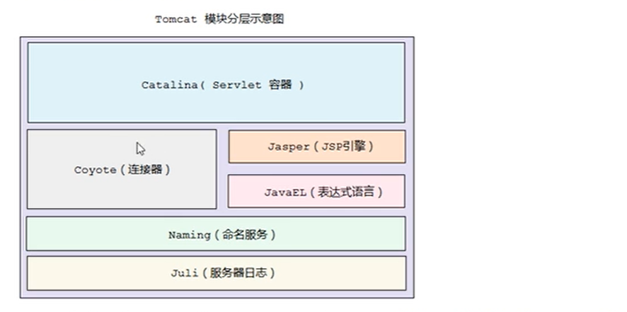

1. maven编译

```
mvn clean package -Dmaven.wagon.http.ssl.insecure=true -Dmaven.wagon.http.ssl.allowall=true -Dmaven.test.skip=true
```


2. 启动参数配置如下：

```
-Dcatalina.home=E:/IntellgintService/tomcat8-gitee/launch
-Dcatalina.base=E:/IntellgintService/tomcat8-gitee/launch
-Djava.util.logging.manager=org.apache.juli.ClassLoaderLogManager
-Djava.util.logging.config.file=E:/IntellgintService/tomcat8-gitee/launch/conf/logging.properties

```


3. tomcat框架 

4. tomcat模块分层结构图

