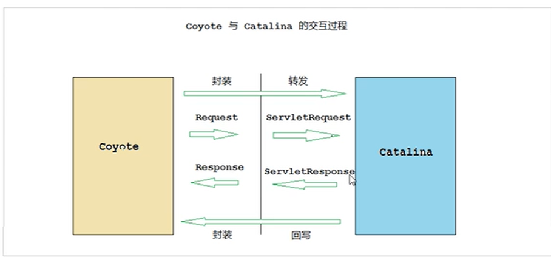

### 连接器
>
> Coyote是tomcat的连接器框架的名称，是tomcat提供的客户端访问的外部接口。客户端通过与Coyote模块建立连接、发送请求并接受响应

#### IO模型与协议

| IO模型 | 描述                                                 |
| ------ | ---------------------------------------------------- |
| NIO    | 非阻塞 I/O，采用 Java NIO 类库实现；                 |
| NIO2   | 异步I/O，采用 JDK 7 最新的 NIO2 类库实现；           |
| APR    | 采用 Apache可移植运行库实现，是 C/C++ 编写的本地库。 |

#### 应用层协议

| 应用层协议 | 描述                                            |
| ---------- | ----------------------------------------------- |
| HTTP/1.1   | 这是大部分 Web 应用采用的访问协议；（默认协议） |
| AJP        | 用于和 Web 服务器集成（如 Apache）              |
| HTTP/2     |                                                 |

#### 连接器组件

 