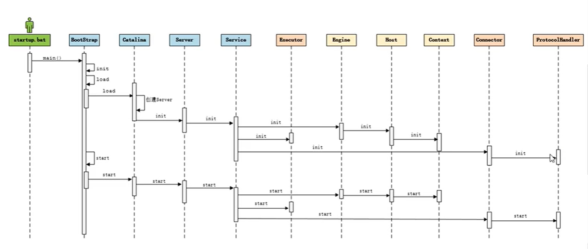
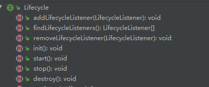
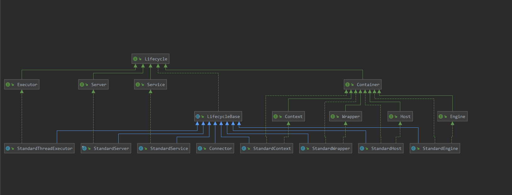
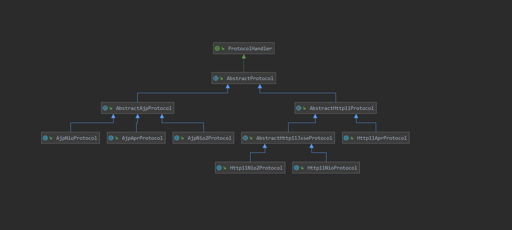

问题1：为什么Bootstrap启动流程中Catalina的调用不是通过new，而是通过反射？

从上图观之，每个组件都有对应的init和start，因此Tomcat设计了一个公共接口LifeCycle

### LifeCycle

由于所有组件存在初始化、启动、停止等生命周期方法，所以Tomcat设计了一个公共接口LifeCycle。核心方法如下：

1. init() 
2. start()
3. stop()
4. destroy()

### 协议

