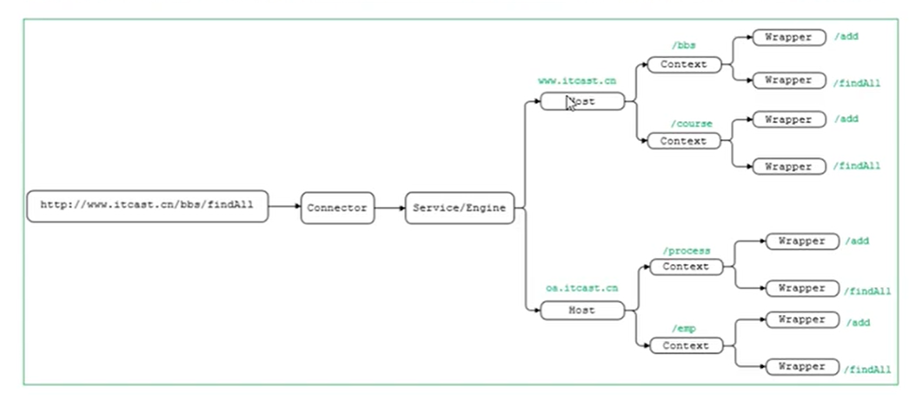
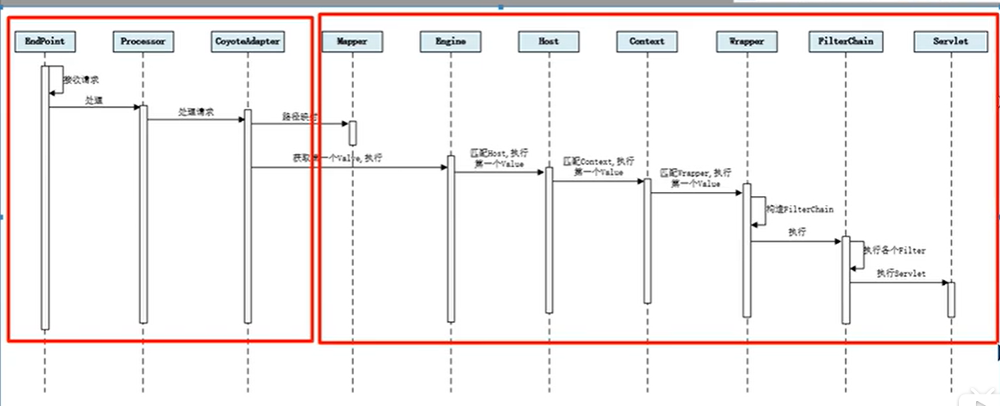
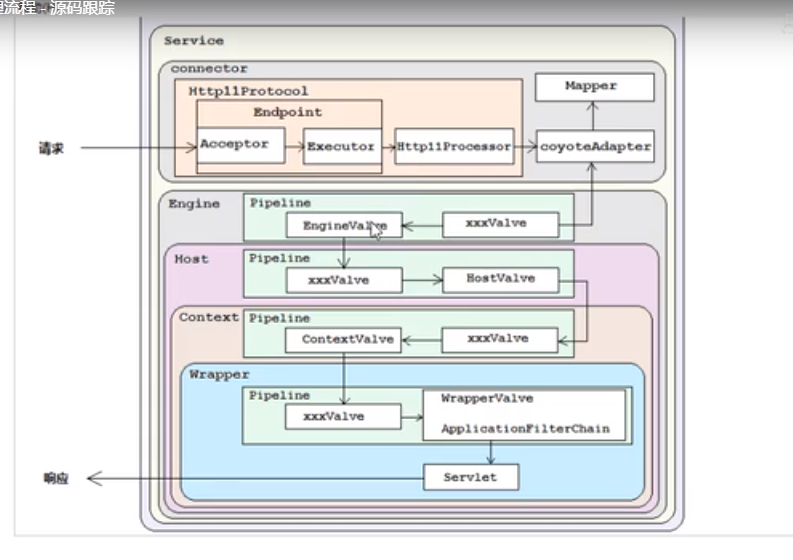

Tomcat中EndPoint的最上层是抽象类AbstractEndPoint

请求处理流程

 

1. Connector组件EndPoint中的Acceptor监听客户端套接字连接并接受Socket(NioEndpoint.Poller.run())
2. 将连接交给线程池Executor处理，开始执行请求响应任务（NioEndpoint.processSocket() ==> SocketProcessor.run()）

在Tomcat中定义了Pipline和Valve两个接口，Pipline用于构建责任链，后者代表责任链上的每个处理器